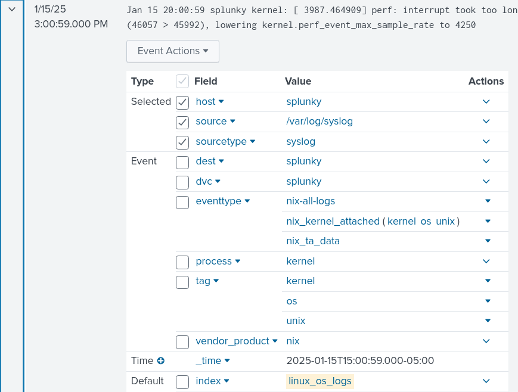

## 90 Day Security Challenge: Day 1

Welcome to blog series about my journey through the 90 Day Security Challenge. My goals for this series is as follows:

1. Accountability for myself to complete it.
2. Have proof that I learned something.
3. Have fun

### Rules of the Challenge

The text below is taken from the email that got sent to me when I accepted the challenge. Here's a link to sign up if you're interested: <a href="https://go.haxsecurity.com/90-days-challenge" target="_blank"> 90-Day-Challenge </a>

```
This program features 9 challenges with 3-5 tasks each to build your skills in Security Investigation, Threat Hunting, Forensics, and more.

Challenges Include:
Each challenge is expected to be completed in 10 days.

1️⃣ Ubuntu Security Investigation with Splunk
2️⃣ Windows Security Investigation with Splunk
3️⃣ Ubuntu Security Investigation with ELK SIEM
4️⃣ Windows Security Investigation with ELK SIEM
5️⃣ Malware Traffic Analysis using Wireshark
6️⃣ Practical Threat Hunting
7️⃣ Endpoint Forensics & Compliance Audit
8️⃣ AWS Cloud Threat Detection & Response
9️⃣ Hands-on Web App Pentesting
```

It might take me longer or shorter than 90 days, but I will my best to break up what I did day by day. Here's a quick breakdown of what I'll write about:

<strong>
1. Challenges faced <br>
2. Observations made <br>
3. Successes and how I felt
</strong>

### Challenge 1: Lab Set-Up

<br>
<em> An accurate representation of how I felt doing this</em>

Perhaps the photo is a bit of an exaggeration. I've gotten pretty good at setting up VMs and I have a bit of knowledge with Splunk. My frustration stemmed from configuring the Splunk Universal Forwarder. It turns out your `forward-server` IP address is from the same machine the Forwarder is installed, not the one where Splunk Enterprise is installed. A simple mistake had me googling and reading forums like a madman for no reason.

Something that I thought was cool was the creation of custom indexes. For example, I created one called `linux_os_logs`. To make this index actually appear in Splunk, you have to create file called `inputs.conf` located in `/opt/splunkforwarder/system/local`. Inside `inputs.conf`, you put the following text: 
```
[monitor:///var/log/syslog]
disabled = false
index = linux_os_logs
sourcetype = syslog
```

As a result of this, anything coming from `syslog` gets labeled as `linux_os_logs`. This can be great for organizations that want to customize how Splunk displays its findings.


<em>As you can see, the index is labeled as `linux_os_logs` while monitor and sourcetype match the text block above.</em>

The last part of the lab set-up involved installing two Splunk Apps, but I haven't really used them yet. I can write more about them as the days go on.

With the lab set-up complete and running, i am now ready to go onto Task#1: Detection of Unauthorized Access on Linux Blocked by Fail2Ban.