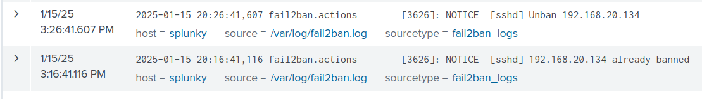

## 90 Day Security Challenge: Day 2

Welcome back to my blog series about my journey through the 90 Day Security Challenge. My goals for this series is as follows:

1. Accountability for myself to complete it.
2. Have proof that I learned something.
3. Have fun

### Challenge 1: Task 1

<br>
<em> How I probably looked doing this lab lol</em>

#### Lab Goal: Install Fail2Ban and Configure it to Detect and Block Malicious IPs

I've never heard of Fail2Ban before this lab. According to our Wikipedia overlords, Fail2Ban is an IPS framework written in Python. It is designed to prevent brute-force attacks. Any IP caught being naughty is sent to "jail" for a certain period of time. You can customize Fail2Ban to give longer "jail times" as the same IP keeps popping up.

I actually found this lab to rather simple. Installing Fail2Ban is as easy as typing `sudo apt install fail2ban`. The configuration file is located in `/etc/fail2ban/jail.local`. For this lab, the focus was on protecting `ssh`, so the following was added to `jail.local`.

```
[sshd]
enabled = true
port = ssh
logpath = /var/log/auth.log
maxretry = 3
bantime = 600
findtime = 600
```

Bantime is set in seconds, so 600 seconds = 10 minutes. Fail2Ban is actually pretty cool in that it's just for ssh. It can configured to monitor any service that writes login attempts to a log file.

Since we are using Splunk. I was able to create an index and sourcetype and called them both `fail2ban_logs.` After adding them to the monitor list, they show up in Splunk itself whenever I incorrectly attempted to ssh into my Ubuntu server. The proof is below.


<em>Notice how it says already banned and then 10 minutes later, it unbans the IP. It works exactly how I configured it.</em>

I'm glad I did this task. Fail2Ban is a great IPS that's worthy of a place in someone's security toolkit. Next up is Task #2: Monitoring and Investigating Suspicious Process Execution.